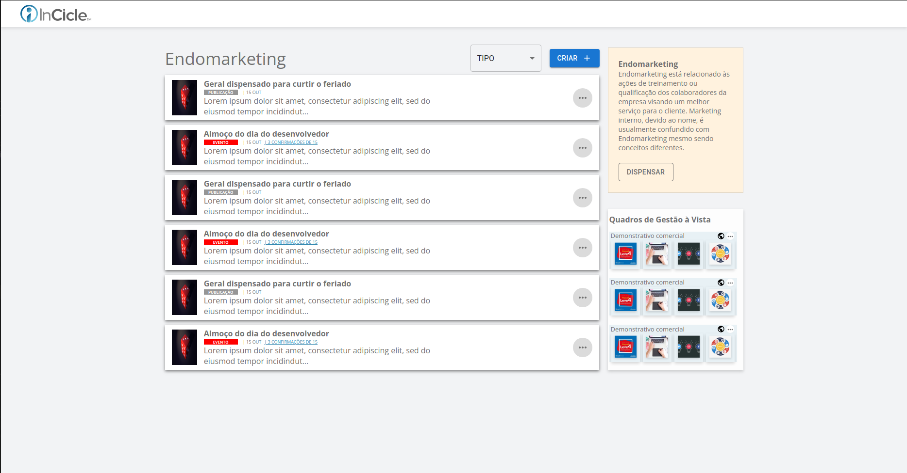

<h1 align="center">ENDOMARKETING</h1>
<br><br>

## Projeto

Teste técnico para front-end, uma página única totalmente responsiva.

## Tecnologias

- [React](https://pt-br.reactjs.org/)
- [NodeJS](https://nodejs.org/en/)
- [TypeScript](https://www.typescriptlang.org/)
- [MaterialUI v5.0](https://mui.com/pt/)
- [Styled Components](https://styled-components.com/)


## Deploy

Deploy da aplicação realizada na vercel - [ENDOMARKETING](https://endomarketing.vercel.app/)

## Como usar

- Rode ```git clone https://github.com/hash-luk/endomarketing.git```
- Depois ```cd endomarketing```
- Instale as dependências com ```npm install```
- Rode o projeto com ```npm start```

<br>

- Caso ele não abra automaticamente, vã ao navegador e digite ```localhost:3000```


<br>

## Conhecimentos utilizados

- Responsividade
- Consumo de API local no front-end
- Verionamento de código com GIT
- Layoutização
- Desenvolvimendo de aplicações

<br>

## Print



<br>

<p align="center">Desenvolvido por Lucas P ❤️</p>

